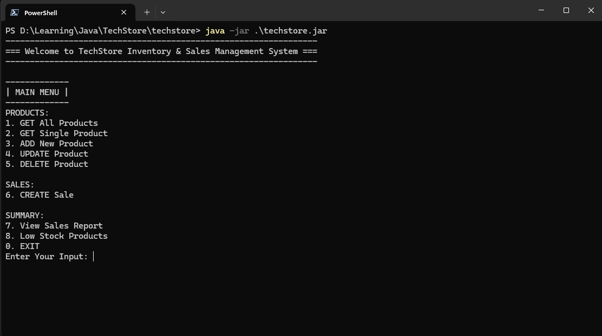
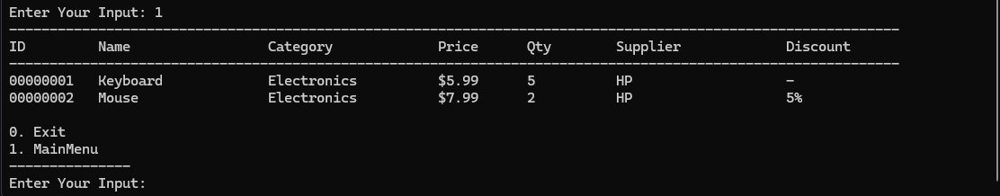
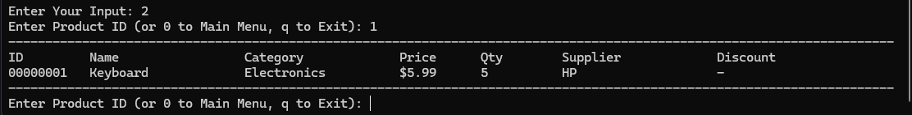
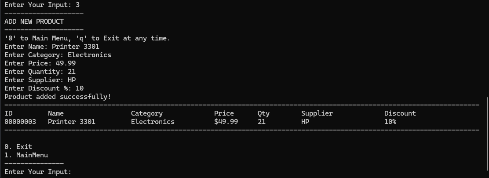
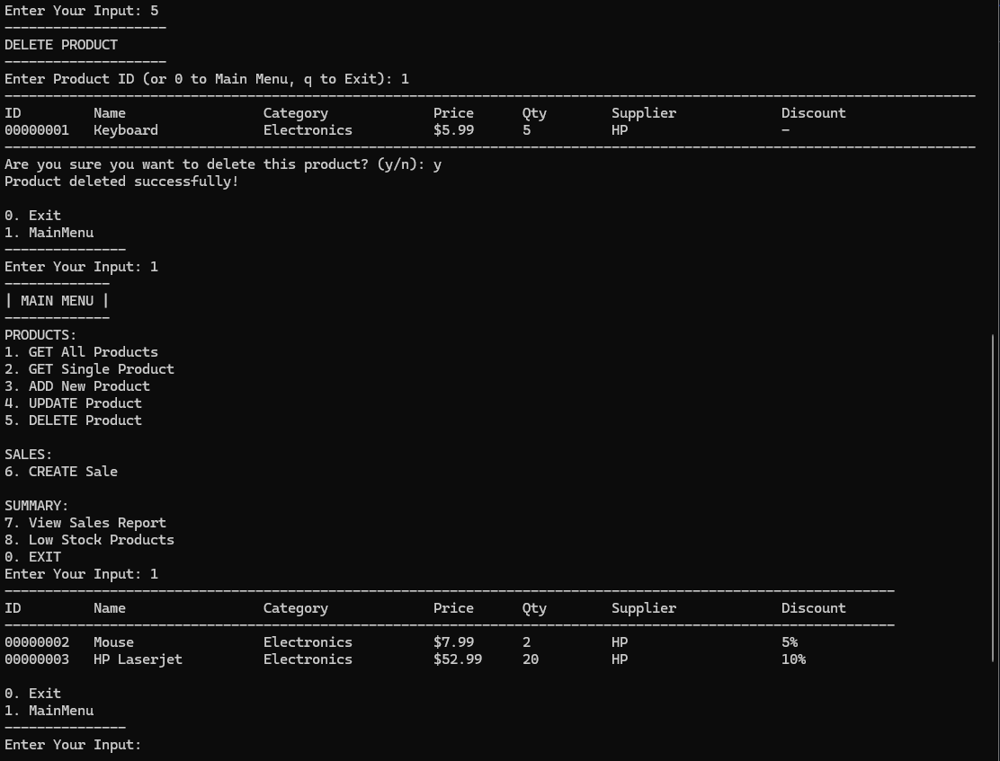
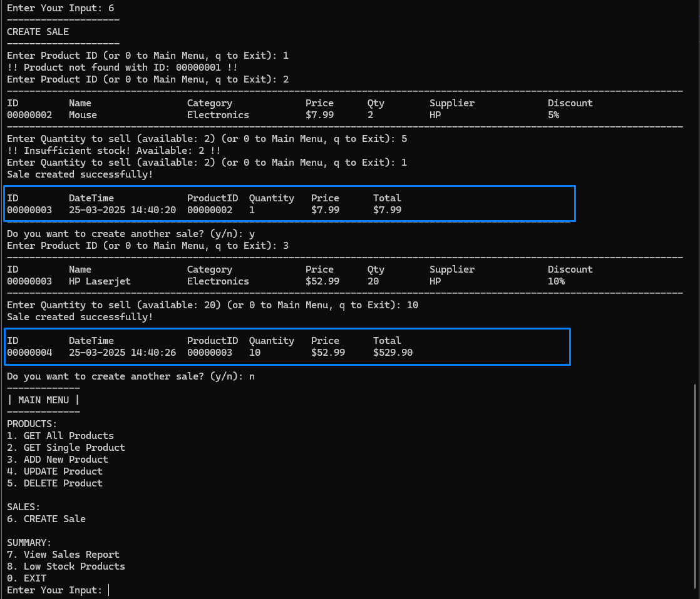
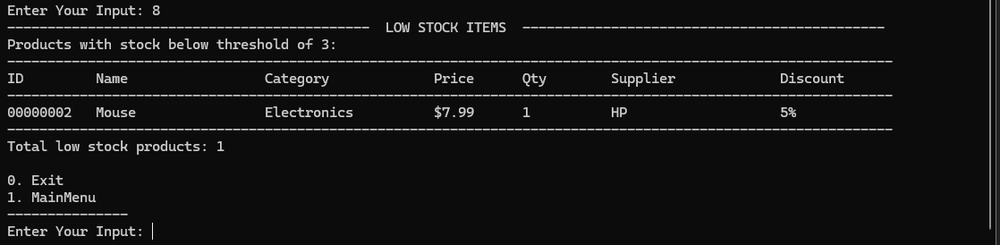
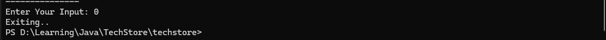

# TechStore - Dockerized Java App
>TechStore is a simple Java CLI application to manage product inventory and sales. This version is containerized using Docker for easy deployment and testing.

## 📦 Features

- **Product Management:**
  - Add new products
  - Update existing products
  - Delete products
  - View all products
  - View single product
  - View low stock products
- **Sales Management:**
  - Make a sale
  - View sales report

## 🔧 Prerequisites

- Java 21 (already compiled into the JAR)
- Docker installed and running, if using Docker Method

## 🚀 Run the App → Using Java
- Go to `src/techstore/main/Main.java`
- Right-click → `Run 'Main.main()'`

## 🚀 Run the App → Using Docker

## Build Docker Image
`docker build -t techstore-app .`

### Basic Run (Temporary):
`docker run --rm -it techstore-app`

### 💾 To persist `data/`:
**Windows (CMD):**  
`docker run -v %cd%/data:/app/data --rm -it techstore-app`

**WSL/Linux/macOS (Bash):**  
`docker run -v "$PWD/data:/app/data" --rm -it techstore-app`

## 🧪 Running Tests

Unit tests for TechStore are written using **JUnit 5** and are located in the `/test` folder.

### 🛠 How to Run Tests (via IntelliJ):

#### Setup Test Run Configuration
- Go to `File` → `Project Structure` → `Modules` → `Dependencies` tab
- Click the `+` button → `JARs or directories...`
- Download the JUnit 5 JAR from [here](https://repo1.maven.org/maven2/org/junit/platform/junit-platform-console-standalone/1.9.3/junit-platform-console-standalone-1.9.3.jar)
- Set the scope to `Test` → `Apply` → `OK`
- Right-click the `test/` folder → `Mark Directory as` → `Test Sources Root`

#### Run Tests
- Right-click the `test/` folder or any test class → `Run 'All Tests'`
- You will see test results in the IntelliJ Run tab

## 📸 Screenshots

### Main Menu

### All Products

### Single Product

### Add Product

### Update Product

### Delete Product

### Make Sale

### Sales Report

### Low Stock Report

### Exit

## 📝 License

This project is licensed under the MIT License - see the [LICENSE](LICENSE) file for details.
